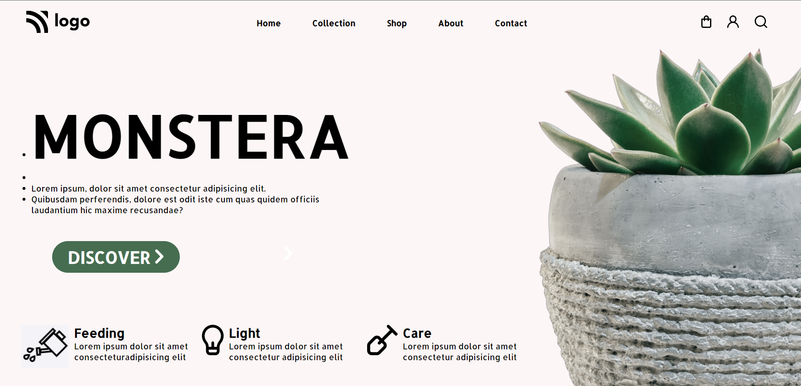

# Hey Welcome

Hi, My name is Uvesh Khatri and I have completed the 6th Project of the iNeuron Full Stack Course.

# Project 6

In this project i have created a Plant Home Page. And i have learnt a lot of things like Position.

It took me 4  Hours to complete this project
## Tech Stack Used 
- HTML5

- CSS

## My Project is looking like :

[Live Link](https://uveshkhatri-plant-home-page.netlify.app/)